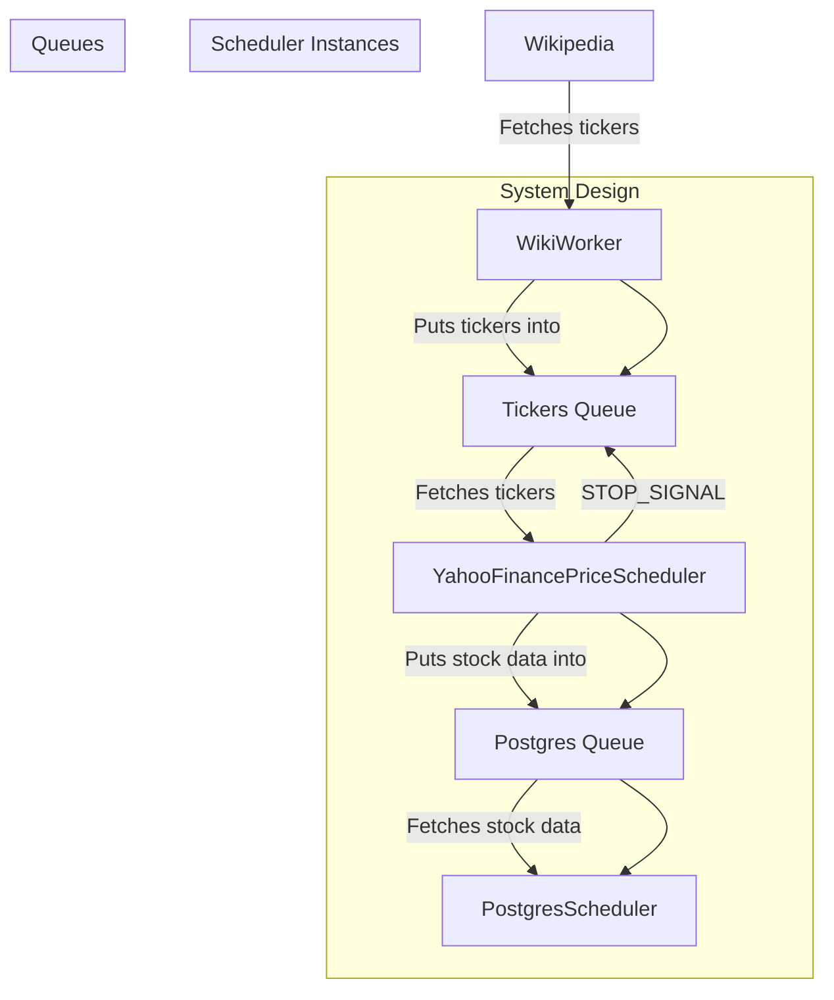

# Concurrent-and-Parallel-Programming-in-Python

This project implements the code examples from the course: `Concurrent and Parallel Programming in Python` by Maximilian Schallwig.

## Topics

1. [Overview](#overview)
2. [Goals](#goals)
3. [Scope and Context](#scope-and-context)
4. [System Design](#system-design)
5. [Alternatives Considered](#alternatives-considered)
6. [Learning Logs](#learning-logs)
7. [Resources](#resources)

---

## Overview

The project involves building a system that fetches the list of companies from the S&P 500 and retrieves the stock information for each of those companies using Yahoo Finance.

The stock data is then inserted into a PostgreSQL database. The system leverages concurrent and parallel programming in Python to efficiently manage the flow of data between different components: fetching the list of companies, retrieving stock prices, and storing the data in the database.

### Processing Logs


### Results from DB

```sql
select * from public.prices;
```


## Goals

The primary goal of this project is to learn and demonstrate the concepts of concurrent and parallel programming in Python.

By building a simple yet practical application, we aim to understand how to manage multiple tasks simultaneously, efficiently handle inter-process communication, and effectively utilize system resources.

The project showcases the use of Python's built-in queue functionality, multiprocessing, and logging modules to create a robust and scalable application.

## Scope and Context

The scope of this project includes:

1. Fetching the list of S&P 500 companies from Wikipedia.
2. Using multiple worker instances to retrieve stock price information concurrently from Yahoo Finance.
3. Storing the retrieved stock data in a PostgreSQL database using multiple database worker instances.
4. Implementing a logging system to monitor and debug the application.

The project is designed to be a learning exercise, focusing on the practical application of concurrent and parallel programming concepts. It provides a hands-on approach to understanding how to build and manage a system that performs multiple tasks simultaneously, highlighting the challenges and solutions associated with such an approach. The context of this project is educational, aimed at enhancing the developer's skills in Python and system design.

## System Design



## Alternatives Considered

## Learning Logs

| Date | Learning |
|------|----------|
| 06-08-2024 | Psycopg3 (psycopg) has been realized and offers optimizations for psycopg2. |
| 06-09-2024 | DB_HOST can be set to db (service) name in the docker-compose.yaml for connectivity between the db and the app. |

## Resources

- [Concurrent and Parallel Programming in Python](https://learning.oreilly.com/course/concurrent-and-parallel/9781804611944/)
